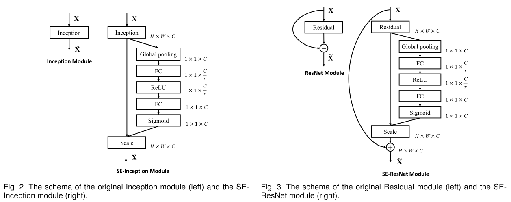
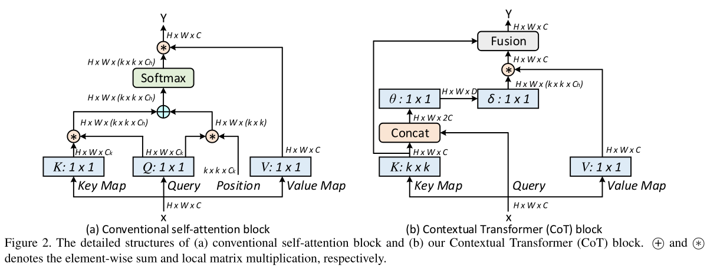

# yolo-learn

## Base environment

```
python: 3.10
torch: 2.3.2+cu121
torchvision: 0.18.1+cu121
timm: 1.0.7
ultralytics repository: 8.2.75

time: 2024-08-09
```

## Six steps add new module

- `task.py`
  - 最前面的 `import`
  - `912` 行的 `parse_model()` 函数中添加新模型的解析
  - `955` 行的 `C2` 模块
- `__init__.py`
  - 添加新模型的 `import`
  - 添加新模型的注册 `__all__ = ['模型名', ...]`
- `blocks.py`
  - 添加新模块的注册 `__all__ = ['模型名', ...]`

## Attention Modules

### SE-Attention

*cite：[Squeeze-and-Excitation Networks](https://arxiv.org/abs/1709.01507)*



> *block.py: 1055 lines*


### Cot-Attention

*cite：[Contextual Transformer Networks for Visual Recognition](https://arxiv.org/abs/2107.12292)*



> *block.py: 1082 lines*


